<p align="center">
    
</p>

## Qué es Docker?

<!--  -->


Docker es un **software opensource** que permite **crear, probar e implementar** aplicaciones rápidamente. Docker, como su nombre indica (**Contenedor**), crea **contenedores** con un conjunto de herramientas que permite el **diesplegue de aplicaciones rapidamente** desde cualquier máquina. Estos, al contrario que en las máquina virtuales convencionales, se **ejecutan utilizando directamente los recursos de nuestra máquina local**, permitiendo así un **mayor rendimiento**. Podemos hablar de **Docker como una solución para la gestión de contenedores**. Este nos proporciona una serie de herramientas que nos permiten **manejar el ciclo de vida de los contenedores.**

Los **desarrolladores** de software, utilizan Docker para **empaquetar las aplicaciones** dentro de contenedores, de esta manera, se pueden desplegar en cualquier otra máquina **sin tener en cuenta las dependencias y versiones necesarias** para su inicialización.

Docker crea dos conceptos, **imagen y contenedor**.

### Que es una imagen?
Podemos decir que una **imagen Docker** es una **plantilla que incluye las dependencias y aplicaciones necesarias**, para construir **contenedores Docker**. Por ejemplo, una imagen puede contener un Ubuntu 18.04 con Apache y la aplicación web instalada para funcionar. Estas imagenes son **estáticas**, es decir, nunca se modifican, por lo que todos los contenedores nuevos que creemos a partir de una imagen concreta serán iguales (al inicio).

Hay muchas **imágenes públicas** que podemos utilizar para desplegar nuestros contenedores, o como base de nuestra imagen. Estas las podemos encontrar en https://hub.docker.com

Además, podemos **crear** nuestras propias imágenes mediante **Dockerfiles**:

### Que es un Dockerfile?
Un Dockerfile es un **archivo de configuración para crear imagenes**. En dicho archivo indicamos qué es lo que queremos que tenga la imagen, y los distintos comandos para instalar las herramientas. Este es un ejemplo de un **Dockerfile:**
```
FROM node
RUN mkdir myapp
WORKDIR /myapp
COPY ./src .
EXPOSE 3000
RUN npm install
CMD [ "node","app.js" ]
```
En dicho ejemplo, estamos creando una **nueva imagen personalizada** a partir de una imagen (en Docker Hub) de **Node**. Además, **creamos un directorio de trabajo** donde se **copiará** el contenido de nuestra carpeta local ./src. Se **publicara el puerto 3000** y se instalarán las **dependencias necesarias** de del gestor de paquetes NPM. Finalmente, cada vez que se ejecute un contenedor con esta imagen, se lanzará el comando **node app.js**

Para crear una imagen a partir de nuestro Dockerfile, ejecutamos el comando:

```
sudo docker build .
```

### Que es un contenedor?
Un **contenedor es una instancia de una imagen.** Es decir, cuando queremos **ejecutar una imagen**, debemos hacerlo mediante un contenedor. Podemos crear tantos contenedores a partir de una imagen como queramos. **No se debe confundir contenedor con máquina virtual**. El concepto de contenedor es como si restauráramos una máquina virtual a partir de un snapshot. 
**Pero para que se pueden utilizar?** Por ejemplo, podemos tener **copias de la aplicación ejecutándose en varios contenedores**, para luego, a través de **balanceadores de carga**, distribuir los accesos a la aplicación, y ofrecer servicios con más garantías y con menos carga de peticiones en cada contenedor.

Para ejecutar un **contenedor a partir de una imagen**, lanzamos el comando:
```
sudo docker run nombre_imagen
```

### Como instalar Docker?
Para instalar docker, ejecutamos los **siguientes comandos:**
```
sudo apt update

sudo apt install apt-transport-https ca-certificates curl software-properties-common

curl -fsSL https://download.docker.com/linux/ubuntu/gpg | sudo apt-key add -

sudo add-apt-repository "deb [arch=amd64] https://download.docker.com/linux/ubuntu bionic stable"

sudo apt update

apt-cache policy docker-ce

sudo apt install docker-ce

sudo systemctl status docker

```


## Que es Docker Compose?
**Docker Compose**es una herramienta que **simplifica el uso de Docker.** Cuando necesitamos ejecutar **varios contenedores conjuntamente**, en la misma red, y por ejemplo, dependiente del estado de otro contenedor, utilizamos Docker-Compose para **agilizar y mejorar** este proceso. Cabe destacar que podemos utilizar ficheros docker-compose y Dockerfile conjuntamente para la creación de contenedores, es decir, **crear un contenedor en Docker-compose a partir de un Dockerfile.** Como se crea un **docker-compose.yml**?

### Como instalar Docker Compose?
Para instalar la versión stable, ejecutamos los siguientes comandos:
```
sudo curl -L "https://github.com/docker/compose/releases/download/1.26.0/docker-compose-$(uname -s)-$(uname -m)" -o /usr/local/bin/docker-compose
```
```
sudo chmod +x /usr/local/bin/docker-compose
```

Para verificar que se ha instalado correctamente:
```docker-compose -v```

Este es un ejemplo:
```
version: '3'

services:
  webmvc:
    image: eshop/webmvc
    environment:
      - CatalogUrl=http://catalog-api
      - OrderingUrl=http://ordering-api
      - BasketUrl=http://basket-api
    ports:
      - "5100:80"
    depends_on:
      - catalog-api
      - ordering-api
      - basket-api
```

Como ejecutar un fichero docker-compose.yml:
``` sudo docker-compose up ```

## Qué es Prometheus?

<!--  -->


**Prometheus** es un **sistema de monitorización** escrito en GO. Con este podemos almacenar **información sobre todos los logs de nuestra aplicación**, entre ellos, acceso a endpoints.

### Características Principales
- **Modelo de datos multidimensional:** con datos de series de tiempo identificados por nombre métrico y claves/ valores pares.
- **Lenguaje flexible de consultas:** permite aprovechar esta multidimensionalidad para consultar los datos de manera simple y flexible.
- **Nodos autónomos de servidor único:** debido a la poca confianza en el almacenamiento distribuido, la colección de series de tiempo ocurre a través de un modelo de extracción, por medio de HTTP.
- **Configuración estática:** los objetivos se determinan mediante configuración estática o descubrimiento de servicios.

Para la creación de nuestro servidor Prometheus, utilizaremos el siguiente fichero de configuración **prometheus.yml**, ubicado en la carpeta **./prometheus**:

<!-- 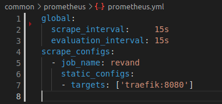 -->


Para visualizar las métricas generadas por Prometheus, utilizaremos Grafana.

## Qué es Grafana?

<!--  -->


**Grafana** es una plataforma de **analisis de métricas**, perminiténdonos **consultar, visualizar, alertar y comprender** los fatos generados. Está escrita en Go y NodeJs y actualmente es u**na de las aplciaciones más utilizadas** para el analisis de metricas.

A partir de una serie de datos recolectados por (en nuestro caso) prometheus obtendremos un **panorama gráfico de la situación de nuestra aplicación.**

Para el despliegue de nuestra aplicación Grafana, utilizaremos el siguiente fichero de configuración **datasources.yml** ubucado en el directorio **./grafana**:

<!-- 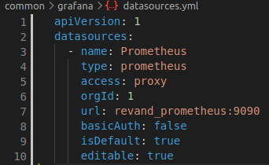 -->


## Qué es Go?


**Go** es un **nuevo lenguaje de programación** desarrollado por **Google**, nacido en 2009, pero se considera un lenguaje maduro con el cual se han desarrollado miles de proyectos alrededor del mundo. Es un lenguaje **tipado estático**, es decir, una vez declaremos una variable, esta no podrá cambiar de tipo en todo el programa, pero no es necesario indicarle el tipo al instanciarla. 

Es un lenguaje **extremadamente rápido**, ya que fue diseñado para la aumentar velocidad de nuestras aplicaciones. Su **eficencia es equiparable a C** y mucha gente opina que será su sustituto natural, ya que su **sintaxis está insiparada en este mismo.**

Go es muy famoso por su **facilidad para crear microservicios**, ya que es donde destaca realmente su eficiencia.

### Que son los microservicios?

Los **microservicios** son un tipo de arquitectura que sirve para diseñar aplicaciones. Lo que distingue a la arquitectura de microservicios de los enfoques tradicionales y monolíticos es la forma en que **desglosa una aplicación en sus funciones principales**. Cada función se denomina **servicio** y se puede diseñar e implementar de forma independiente. Por ejemplo, podemos tener un microservicio de **usuarios, otro de productos, y uno de comentarios**. En el caso de que el servico de comentarios **falle**, nuestra aplicacion **seguira funcionando ya que es totalmente independiente.** 

### Qué es Go Modules?

Los módulos son la forma en que Go gestiona las dependencias. Un **module** es una **coleción de paquetes de Go** almacenados en un fichero llamado **go.mod**. El fichero go.mod define la ruta del módulo, que también es la ruta de importación utilizada para el directorio raíz. El comando go habilita el uso de modulos siempre y cuando el directorio principal que tiene un go.mod, se encuentre fuera del directorio $GOPATH/src.

## Qué es Traefik?

<!--  -->


**Traefik** es un **balanceador de carga y proxy inverso HTTP** moderno que **facilita la implementación de microservicios.** Este se integra con los componentes de su infraestructura existente ( Docker, Kubernetes, Amazon ECS, etc) y se configura automáticamente de forma dinámica.

### ¿Qué es un balanceador de carga?

Un **balanceador de carga** asigna o **distribuye las solicitudes que llegan de los clientes** a los servidores usando un algoritmo, en nuestro caso, elegiremos a que microservicio Go debería ir la solicitud.

### ¿Qué es un proxy inverso HTTP?

**Un proxy inverso** es un tipo de servidor proxy que **recupera recursos en nombre de un cliente**, es decir, recupera **la ruta establecida (example.com/blog)**. Éste permite a Traefik decidir a que servidor enviar la peticion.

## Refactorizar Backend Go a Go Modules

Anteriormente, utilizabamos GOPATH para especificar la ruta donde estará el workspace, es decir, donde ubicaremos nuestros proyectos Go. Dentro de este workspace se instalaban las dependencias de nuestros proyectos y puede llegar a ser tedioso crear un nuevo proyecto o dockerizarlo. Este es un breve ejemplo de como funcionaba anteriormente:

### Docker-Compose.yml

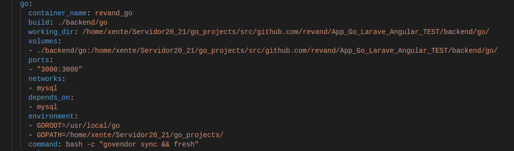

### Dockerfile

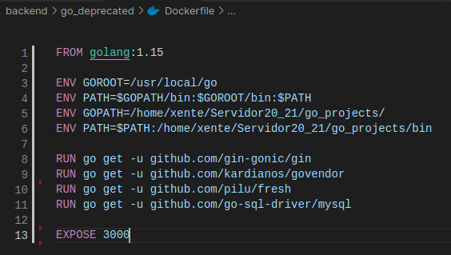

Esta manera de trabajar está anticuada ya que otros lenguajes de programación disponen de un gestor de paquetes el cual nos permite instalar las dependencias fácilmente y es más sencillo empezar un nuevo proyecto (ya que no es necesario crear un workspace de GOPATH para ubicar nuestros proyectos).

Al importar nuestros packages en la aplicación, es necesario indicar la ruta completa desde el workspace, las cuales quedarían así:

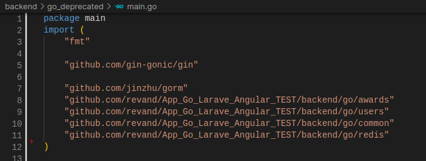

### Refactorización

Al refactorizar Go a Go Modules, ya no es necesario disponer de un Dockerfile, lo cual simplifica el proceso. Nuestro docker-compose.yml quedaría finalmente así:

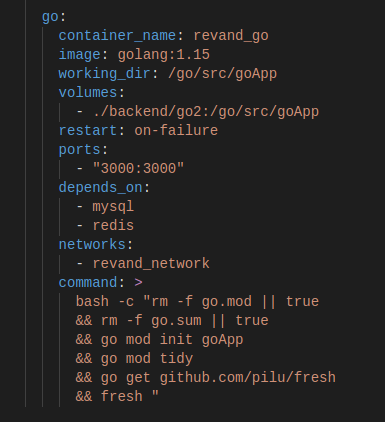

En el parámetro **command:** indicamos una serie de comandos que se ejecutarán al lanzarse el contenedor. 
Primero, confirmamos que no existan anteriores ficheros go.mod y go.sum para evitar conflictos. A continuación, inicializamos nuestro proyecto por módulos con ```go mod init goApp``` ('goApp' es el nombre que hemos indicado a nuestro proyecto en el volumes de docker-compose.yml). Seguidamente, se ejecuta el comando go mod tidy el cual descarga las dependencias que encuentre en nuestros archivos .go y las añade a go.mod y go.sum. Finalmente instalamos fresh para ejecutar nuestro programa y lo iniciamos.

```
bash -c "rm -f go.mod || true
      && rm -f go.sum || true
      && go mod init goApp
      && go mod tidy
      && go get github.com/pilu/fresh
      && fresh "
```

Hay que tener en cuenta que ya no trabajamos desde el workspace indicado en GOPATH, por lo que las rutas en nuestro programa go cambian:


## Refactorizar aplicación Go a Microservicios independientes

Anteriormente, nuestro backend Go agrupaba todas las funcionalidades en una única arquitectura tradicional y monolítica. Esto conlleva varios riesgos, ya que en caso de que falle, todo nuestro backend quedaría paralizado. Cada 'funcionalidad' se ubicaba en un package, por lo que la estructura y los imports serían los siguientes:

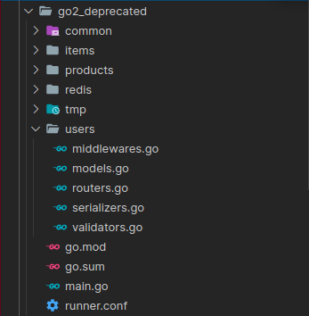


Al utilizar la **nueva arquitectura de microservicios**, el backend queda más **limpio** y además es más **eficiente** y **resistente a fallos**.

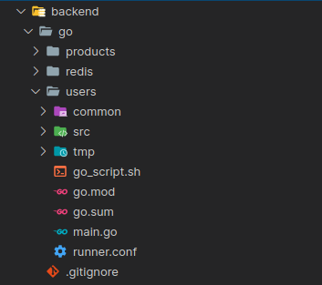

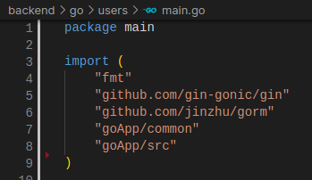

Disponemos de tres microservicios **(users, redis y products)**. Dentro de cada uno, se hayan tres directorios **(common,src y tmp)**. 

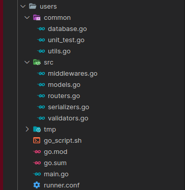

- En **common** tenemos la **conexión a la base de datos** y los tests, junto a los credenciales necesarios para la autenticación.
- En **src** se encuentran los **ficheros necesarios** para el funcionamiento clave del microservicio. Podemos observar que la cantidad de ficheros en los microservicios es bastante reducida lo cual permite una fácil comprensión del programa. 
- En **tmp** se alamcenan los ficheros temporales.

### Microservicios en Docker-Compose con Traefik

Para lanzar cada microservicio, podemos utilizar **docker-compose** para agilizar el proceso junto a **Traefik**.

**Traefik** se encargará de gestionar y dirigir las peticiones de cada cliente al microservicio en concreto.


Podemos observar en el **servicio traefik** de docker-compose diversos comandos:

- **--api.dashboard=true** , permite acceder a un dashboard versión web de traefik para observar los servicios que contiene. Esta se sirve por el puerto 8080.
- **--api.insecure=true** , la API será accesible desde el entrypoint 8080 nombrado como **traefik**
- **--providers.docker** , habilitar el provider docker para gestionar los servicios i apuntar a las labels de queda microservicio en el docker-compose.
- **--entrypoints.web.address=:80** , definir que el entrypoint **web** escuche por el puerto 80. Todos nuestros microservicios apuntarán a este puerto y Traefik se encargará de gestionarlos.

En el parámetro **volumes:**, hacemos referencia a nuestros contenedores docker para que traefik pueda gestionarlos.

Finalmente, exponemos los puertos 80 y 8080.

#### Crear microservicios en docker-compose


<!-- ESTRUCUTRA GO MICROSERVICIOS


MAINGO MICROSERVICIOS


ESTRUCUTRA USERS INTERNA
 -->

GO_USERS DOCKER COMPOSE
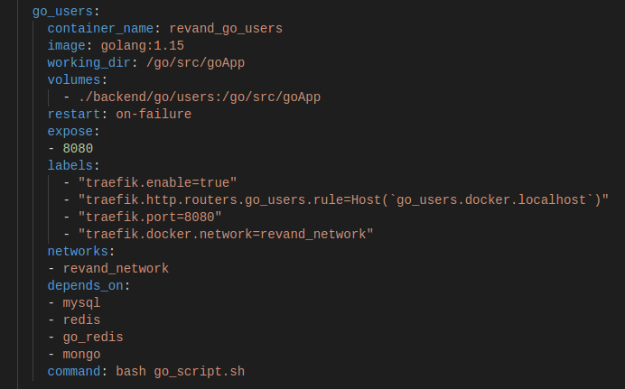

GO_PRODUCTS DOCKER COMPOSE
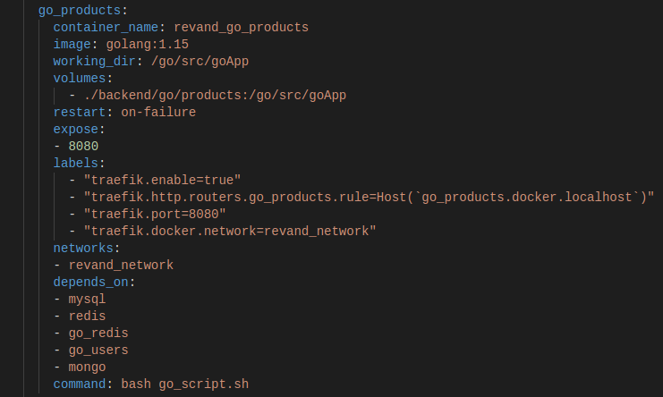

GO_REDIS DOCKER COMPOSE
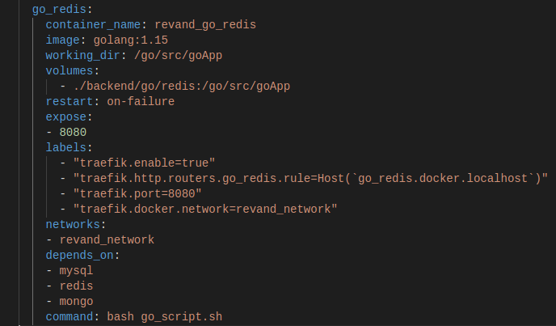

BASH SCRIPT
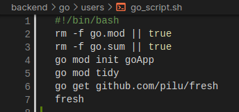

TRAEFIK DOCKER COMPOSE


## Refactorizar Docker-Compose utilizando extends

Vamos a refactorizar nuestro **docker-compose.yml** con la extensión **“extends”**.
Utilizando esta extensión podremos reutilizar parte del código en nuestros microservicios, de esta manera, los parámetros que tengan en común estos microservicios no estarán repetidos en el **docker-compose.yml**.

### Precaución

Antes de empezar, la propiedad **extends** de docker-compose se inhabilito a partir de la versión 3 de archivo, pero investigando en diversos foros, al actualizar nuestra versión local de **docker-compose a v1.27.X**, este volvía a funcionar correctamente. Por lo que es necesario verificar nuestra versión de docker-compose para evitar posibles fallos.

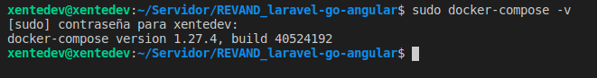

### Crear fichero común

A continuación, creamos un nuevo archivo el cual nombraremos **common-services.yml**. Este archivo contendrá todo el código en común de nuestros microservicios:

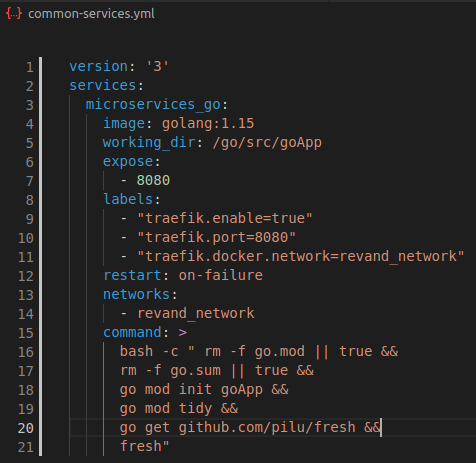

Una vez creado nuestro archivo en común, vamos a modificar nuestro **docker-compose.yml** para indicar a nuestros microservicios que utilicen el fichero **common-services.yml**. Cabe destacar que hay varios parámetros que no pueden ser extendidos ***(por ejemplo, container_name, depends_on, etc)***, además de otros los cuales deben ser únicos en cada microservicio, como los volumes o labels, donde se indica el Host que hace referencia a **Traefik**. Para extender nuestro servicio, incluimos en la parte superior de nuestro microservicio:

```
extends:
  file: common-services.yml
  service: microservices_go
```

Finalmente, nuestros microservicios se verían mucho más simplificados como podemos observar a continuación:

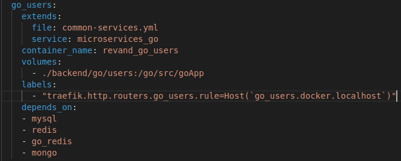

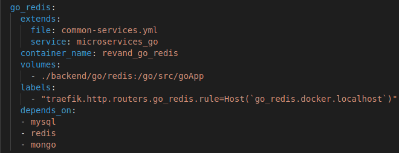

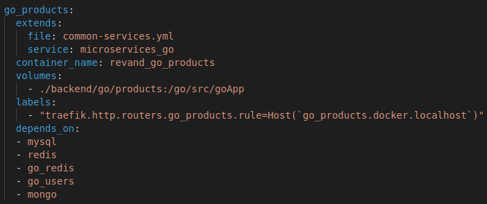

## Implementar Prometheus y Grafana con Traefik

Primero implementaremos **Prometheus** a nuestra aplicación. Para la creación de este servicio, utilizaremos un archivo de configuración llamado **prometheus.yml**


En la configuración usaremos de target el servicio de **Traefik** por el puerto ***8080***.

Para desplegar Grafana en nuestra aplicación correctamente tenemos que crear un archivo de configuración, nombrado como **datasources.yml**:


En el campo URL introducimos el nombre del servicio de **Prometheus** junto al puerto de ese servicio. 

Para implementar **Grafana** y **Prometheus** con **golang** tendremos que añadir los dos nuevos servicios al **docker-compose** y modificar el servicio **Traefik** para que exponga las métricas.
 
Primero vamos a añadir el servicio **Grafana** de la siguiente forma:

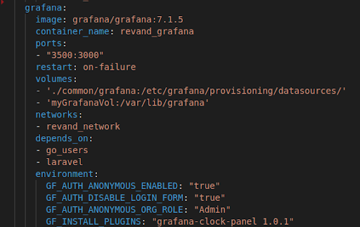

Partiremos de una imagen oficial de grafana, en concreto, la versión 7.1.5. 
Publicaremos el **puerto 3500** y copiaremos el fichero de configuración de grafana a ***/etc/grafana/provisioning/datasources/***. Además, crearemos un volumen **(myGrafanaVol)** asignado al directorio ***/var/lib/grafana***. Para la ejecución del contenedor, es necesario declarar varias variables de entorno para cumplir los requisitos que se exigen. Para ello, en environment, declararemos la siguientes variables:

```
GF_AUTH_ANONYMOUS_ENABLED: "true"
GF_AUTH_DISABLE_LOGIN_FORM: "true"
GF_AUTH_ANONYMOUS_ORG_ROLE: "Admin"
GF_INSTALL_PLUGINS: "grafana-clock-panel 1.0.1"
```

Con estas variables de entorno, los usuarios anónimos estan habilitados, no es necesario logearse para acceder a **Grafana**, y todos aquellos que entren tendrán el rol de admin. Además, instalaremos el plugin "grafana-clock-panel 1.0.1". El contenedor se nombrará ***revand_grafana*** y formará parte de la red ***revand_network***.

Ahora vamos a continuar añadiendo el servicio de **Prometheus** en el **docker-compose.yml** de la siguiente forma:

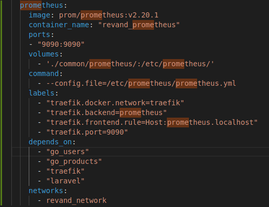

El cual ejecutará una imagen oficial de **Prometheus**, más concretamente, la versión 2.20.1. Se publicará por el **puerto 9090** y copiará el fichero de configuración ubicado en nuestra carpeta ***./common/prometheus*** a ***/etc/prometheus/.*** Además, al ejecutar el contenedor, lanzará el comando ***--config.file=/etc/prometheus/prometheus.yml.*** Nombraremos al contenedor como **revand_prometheus** como lo indicamos en el archivo de configuración del **Grafana** y formará parte de la red **revand_network**.

Finalmente en el servicio de **Traefik** tenemos que añadir los siguientes **commandos** para permitir que exporte las métricas.

```
--metrics.prometheus=true
--metrics.prometheus.buckets=0.1,0.3,1.2,5.0
```
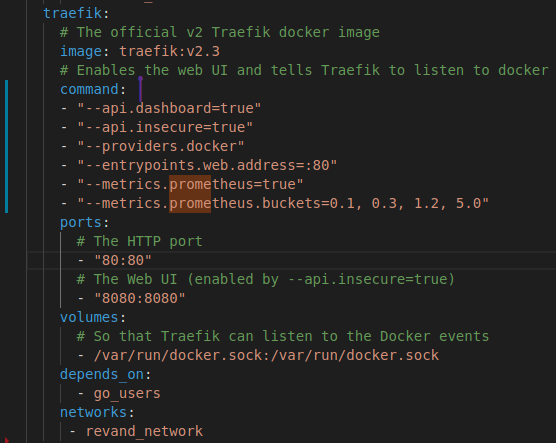

### Comprobaciones

Ahora podemos iniciar el **docker-compose** y comprobar que el servicio de **Prometheus** y el de **Grafana** funcionan correctamente y que **Prometheus** recoje métricas de **Traefik**. 

Para comprobarlo, una vez iniciados nos dirigimos a ***localhost:9090 (prometheus)*** y en la sección Status vamos a Targets y ahí podremos comprobar como **Traefik** envia sus métricas:

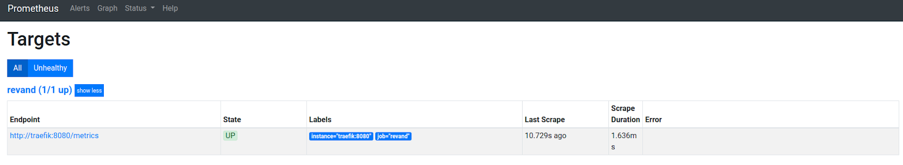

Seguidamente nos podemos dirigir a ***localhost:3500 (grafana)*** y al crear un nuevo panel nos apareceran todos los datos que esta recibiendo **Prometheus** de **Traefik**.

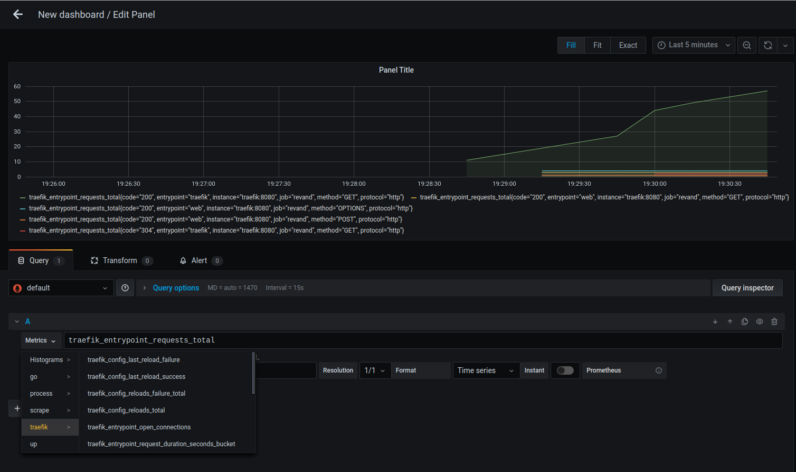


