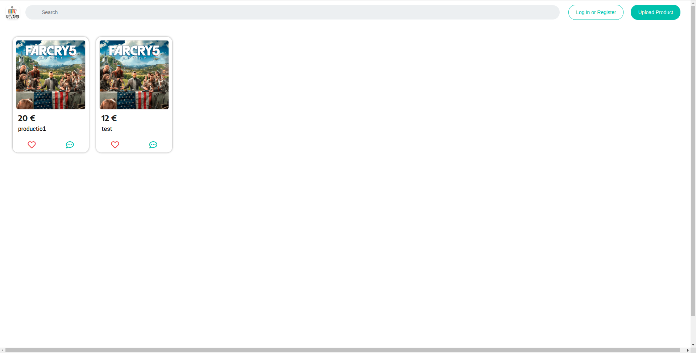
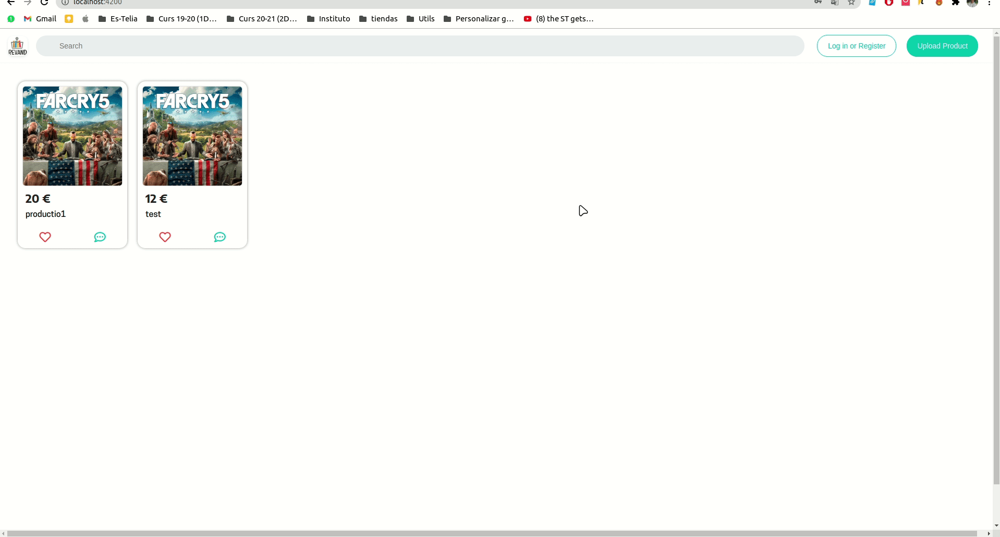
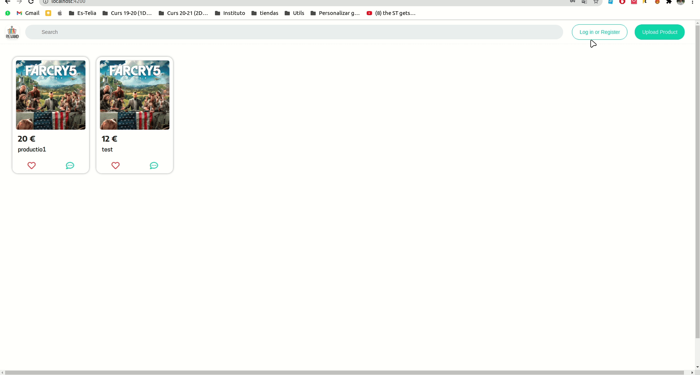
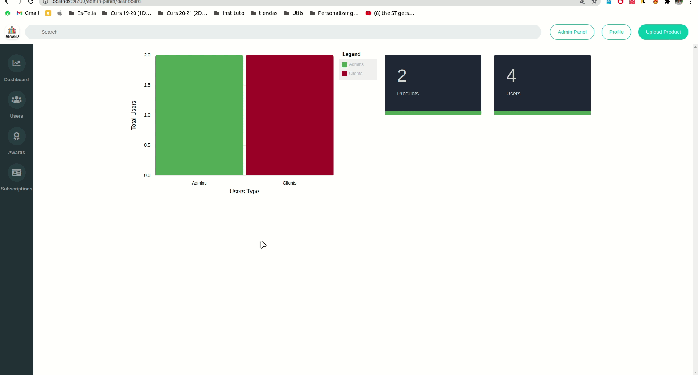

docker-compose version: 1.27

run ./init.sh

# Revand - Laravel_Angular_Go-Microservices

This application simulates the operation of Wallapop. The main purpose is that users can offer their products and customers themselves can get in touch to buy them.

## Preview 📷
All the images shown below are provisional and will not be the final aspect of the web application:
### Homepage

### Auth

### Register

### Product details - Create - Delete

### Settings profile

### Admin Panel

### Stats


## Getting Started

For run the code on your local machine and be able to observe the latest changes you need to install Docker/Docker-Compose and run a shell script.

## Prerequisites

You must have **docker** and **docker-compose** installed on your machine. For install docker correctly, realize the following steps:

[How to install docker (Official Website)](https://docs.docker.com/engine/install/ubuntu/)

Next, you must have a specific version of docker-compose, since the previous ones contain a bug that does not allow the correct operation of the app. Realize the following steps:

```
sudo curl -L "https://github.com/docker/compose/releases/download/1.27.4/docker-compose-$(uname -s)-$(uname -m)" -o /usr/local/bin/docker-compose
```
```
sudo chmod +x /usr/local/bin/docker-compose
```
```
sudo docker-compose --version
```


## Installation

Once you have everything installed, clone this repository and perform the "sudo ./init.sh" command on the main folder.
```
sudo ./init.sh
```


### Features:

| Module | Description |
| --- | --- |
| Home | Main page of the application where you can see the latests products |
| Admin Panel | This module it's used for admin users. They can edit every information in the application |
| Products | You can upload products, or see another users' products |
| Login | Login module with local users in both backends (Laravel and Go with JWT)|
| Profile | In this module you can see your products, change your profile information and see your favorited products |


### Built with 🛠️
* [Angular](https://angular.io/)
* [Laravel](https://laravel.com/)
* [Go](https://golang.org/)
* [Traefik](https://traefik.io/)
* [MySql](https://www.mysql.com/)
* [MongoDB](https://www.mongodb.com/)
* [Redis](https://redis.io/)


## Other technologies
* [Docker](https://www.docker.com)
* [JWT](https://jwt.io/)
* [Toastr](https://www.npmjs.com/package/ngx-toastr)
* [Grafana](https://grafana.com/)
* [Prometheus](https://prometheus.io/)
* [Gorm](https://gorm.io/index.html)
* [Mongo-Driver](https://github.com/mongodb/mongo-go-driver)
* [Mysql-Driver](https://github.com/go-sql-driver/mysql)


